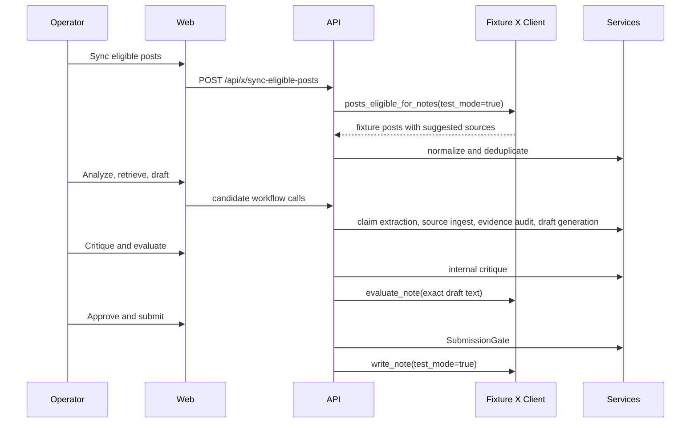

# Architecture

## Components

- `apps/api/app/main.py`: local HTTP runtime exposing the requested API routes and serving the web UI.
- `apps/api/app/models`: domain records corresponding to the required Pydantic/database models.
- `apps/api/app/services`: normalization, fixture LLM/search/evidence, critique, gate, admission, writing-limit, cost, and eval services.
- `apps/api/app/x_client`: typed X Community Notes client protocol plus fixture and disabled-live implementations.
- `apps/web/app`: operator interface for dashboard, queue, detail workflow, admission, writing limit, evals, and settings.
- `packages/shared`: schema contract.
- `packages/evals`: offline fixtures and adversarial cases.

## Data Flow

## Persistence

The local fixture runtime stores records in memory and writes only local markers for `make migrate` and `make seed-fixtures`. Production should wire the same records to Postgres with pgvector and Alembic. The migration sketch in `apps/api/alembic/versions/0001_initial.sql` shows the first table mapping.

## Safety Boundaries

Suggested source links, snippets, post text, retrieved pages, PDFs, and user-entered text are untrusted inputs. They are represented as data only and cannot change settings, gates, system behavior, or approval requirements.

Community Notes API data is scoped solely to Community Notes AI note writing. Operational evals are allowed only when directly necessary to operate the note writer. Track A manual/export workflows require express and informed contributor consent, and Track B write paths require bot-profile disclosure plus responsible-party identity before submission can pass the gate.

External sharing should prefer record IDs, hashes, and rehydration from authorized sources where practical. Full-content redistribution is avoided unless the operator has a specific approved reason and matching authorization.
