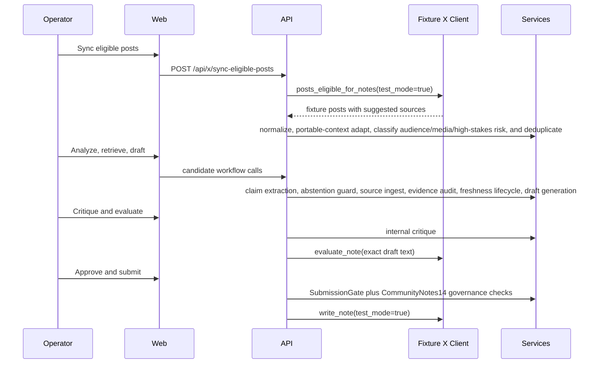

# Architecture

## Components

- `apps/api/app/main.py`: local HTTP runtime exposing the requested API routes and serving the web UI.
- `apps/api/app/models`: domain records corresponding to the required Pydantic/database models.
- `apps/api/app/services`: normalization, fixture LLM/search/evidence, critique, gate, admission, writing-limit, cost, governance, and eval services.
- `apps/api/app/x_client`: typed X Community Notes client protocol plus fixture and disabled-live implementations.
- `apps/web/app`: operator interface for dashboard, queue, detail workflow, admission, writing limit, evals, and settings.
- `packages/shared`: schema contract.
- `packages/evals`: offline fixtures and adversarial cases.

## Data Flow

## CommunityNotes14 Governance Layer

`apps/api/app/services/governance.py` implements the additional controls from `CommunityNotes14.md` as deterministic services that persist their outputs on candidates, drafts, submissions, and audit events:

- Portable context schema and X platform adapter.
- Audience/context classification.
- Media-dependency gating.
- High-stakes domain routing.
- Abstention and redundancy guard.
- Evidence freshness and post-submission lifecycle snapshots.
- Linkable evidence reports.
- Cross-perspective helpfulness precheck.
- Writing-opportunity ranking.
- Retention/access-control classification.
- Methodology transparency registry.
- Policy/documentation drift monitor status.
- Emergency stop and incident-response state.
- Phase/complexity budget, latency SLO metadata, feed strategy/cadence, and official scoring replay status.

The public-safe operational summary is available at `/api/governance` and in the Settings UI. Private thresholds, credentials, private X payloads, and operator identifiers are redacted from public methodology cards.

## Persistence

The local fixture runtime stores records in memory by default. Render/staging uses `PERSISTENCE_PROVIDER=postgres` plus `DATABASE_URL` and writes candidates, drafts, submissions, audits, costs, eval runs, raw candidates, and governance metadata to the JSONB record store. The migration sketch in `apps/api/alembic/versions/0001_initial.sql` shows the first table mapping.

## Safety Boundaries

Suggested source links, snippets, post text, retrieved pages, PDFs, and user-entered text are untrusted inputs. They are represented as data only and cannot change settings, gates, system behavior, or approval requirements.

Community Notes API data is scoped solely to Community Notes AI note writing. Operational evals are allowed only when directly necessary to operate the note writer. Track A manual/export workflows require express and informed contributor consent, and Track B write paths require bot-profile disclosure plus responsible-party identity before submission can pass the gate.

External sharing should prefer record IDs, hashes, and rehydration from authorized sources where practical. Full-content redistribution is avoided unless the operator has a specific approved reason and matching authorization.

`EMERGENCY_STOP_EXTERNAL_WRITES=true` blocks all fixture and live write paths even when ordinary submission checks pass. Keep it available as the first incident-response control.
